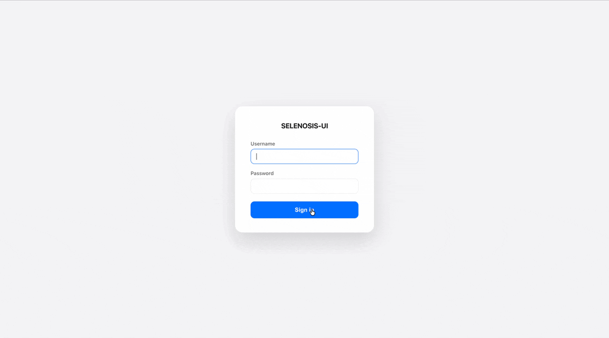

# browser-ui

**Web dashboard and live VNC viewer for the [Selenosis](https://github.com/alcounit/selenosis) ecosystem.**
A stateless Go server that serves a React frontend, lists live browser sessions, and proxies VNC to the browser pods — Kubernetes stays the source of truth.

[](https://github.com/alcounit/browser-ui/releases)
[](https://pkg.go.dev/github.com/alcounit/browser-ui)
[](https://hub.docker.com/r/alcounit/browser-ui)
[](./LICENSE)

<p align="center">
  
</p>

---

## How it fits

browser-ui is the dashboard of a small Kubernetes-native platform. It never talks to the cluster directly — it consumes **browser-service** and proxies VNC to the pods.

| Component | Role |
| --- | --- |
| **[selenosis](https://github.com/alcounit/selenosis)** | Stateless Selenium / Playwright / MCP hub. |
| **[seleniferous](https://github.com/alcounit/seleniferous)** | Sidecar proxy inside each browser pod (incl. the VNC endpoint). |
| **[browser-controller](https://github.com/alcounit/browser-controller)** | Operator reconciling `Browser` / `BrowserConfig` CRDs into pods. |
| **[browser-service](https://github.com/alcounit/browser-service)** | REST + SSE facade over the CRDs. **browser-ui talks only to this.** |
| **browser-ui** (this repo) | Web dashboard, live session list, in-browser VNC viewer. |
| **[selenosis-deploy](https://github.com/alcounit/selenosis-deploy)** | Helm chart that deploys the whole stack. |

---

## How it works

- **Frontend** — React/TypeScript (noVNC, TanStack Query), built with Vite and served under `/ui/`.
- **Backend** — Go HTTP server (chi/v5, zerolog) exposing a small JSON API and a VNC WebSocket proxy.
- **Event collector** — subscribes to the `browser-service` SSE stream (ADDED / MODIFIED / DELETED) and keeps an **in-memory** session store derived from `Browser` resources.

browser-ui is stateless: restart it freely, run multiple replicas. It depends on `browser-service` being reachable at `BROWSER_SERVICE_URL` (and, indirectly, on the controller and CRDs being installed).

---

## VNC viewer

The viewer (`GET /api/v1/browsers/{id}/vnc`) is a WebSocket proxy to the session pod's seleniferous VNC endpoint. The browser image's VNC server is password-protected, and vendors set that password differently (some bake it into the image), so there is **no global server-side password** — the user supplies it in the UI and it is resolved on the client from what was saved before:

1. password saved for this browser **name + version** (`localStorage`, e.g. `chrome@146.0`),
2. password saved for this browser **name** (`localStorage`, any version).

**On first use (nothing saved) or when the password doesn't match**, the viewer shows an inline prompt so the user types the password. After a successful connect it offers to remember it:

- **For all browsers of this name** — reused for every version of that browser (e.g. all `chrome`).
- **Only this browser version** — reused only for that exact `name + version` (e.g. `chrome 146.0`).
- **Don't save** — used once, nothing stored.

Both scopes persist in `localStorage` (the session id is random and dies with the pod, so it is never used as a key). The version-scoped password takes priority over the name-scoped one.

Wrong passwords surface a clear `securityfailure` message and re-prompt; a hard attempt cap prevents retry loops. This keeps a single deployment usable across mixed browser vendors without forcing one shared VNC password.

Before connecting, the viewer checks that the session has a VNC server at all (see [Configuring browsers for the UI](#configuring-browsers-for-the-ui)). If it has none, the viewer says so and never asks for a password.

---

## Configuring browsers for the UI

browser-ui reads two annotations to decide how a browser is shown. Both are plain annotations — no CRD change is involved.

### `selenosis.io/session.type`

What kind of session the image serves: `selenium`, `playwright`, `devtools` or `mcp`.

| Where | Who sets it | Effect in the UI |
| --- | --- | --- |
| BrowserConfig — `spec.template.annotations` or a per-version entry (per-version wins) | operator | Decides whether the browser is offered in the **create-browser menus**. |
| Browser CR | selenosis, when it creates a browser for a Selenium / Playwright / DevTools / MCP request | Label on the **session card** and the session-type filter. |

- **Card label** — one of `selenium`, `playwright`, `devtools`, `mcp`, or `unknown` when the annotation is missing or holds any other value. Clicking a label filters the session list by it.
- **Create-browser menus** (Dashboard *START BROWSER* and the *Start Browser* page) list **only `selenium` browsers**. A browser whose config has no `session.type`, or a type other than `selenium`, is not offered there.

> Every Selenium BrowserConfig must set `selenosis.io/session.type: "selenium"`, otherwise its browsers disappear from the create-browser menus.

### `selenosis.io/session.vnc`

Whether the session has a VNC server. **VNC is available only when the value is `"true"`**; `"false"`, any other value, or no annotation at all means no VNC.

> Every BrowserConfig whose image runs a VNC server must set `selenosis.io/session.vnc: "true"`, otherwise CONNECT stays disabled for its sessions.

| Where | How |
| --- | --- |
| BrowserConfig | `spec.template.annotations` or a per-version entry (per-version wins). If several configs describe the same browser name and version, an explicit `"false"` in any of them wins over `"true"`; configs without the annotation do not count. |
| Per session | selenosis option `annotations.selenosis.io/session.vnc` — as a query parameter (Playwright / DevTools / MCP) or in `selenosis:options` (Selenium). selenosis copies `annotations.*` onto the Browser CR. |

**The per-session value wins over the config in both directions**, so a single session can turn VNC on or off regardless of its BrowserConfig.

When VNC is off, the session card shows a disabled **CONNECT** with the hint *VNC is not available for this browser*, and opening the viewer directly shows the same message instead of a password prompt.

When VNC is declared but the server is not actually there (misconfigured image, crashed server), the viewer probes the session first — `GET /api/v1/browsers/{id}/vnc` without a WebSocket upgrade — and shows *VNC server is not reachable in this session* on `503`.

### Example

```yaml
apiVersion: browserconfig.selenosis.io/v1
kind: BrowserConfig
metadata:
  name: chrome
spec:
  template:
    annotations:
      selenosis.io/session.type: "selenium"
      selenosis.io/session.vnc: "true"
  browsers:
    chrome:
      "131.0":
        image: quay.io/browser/google-chrome-stable:131.0
```

A CDP-only image needs no VNC annotation at all — it is off by default:

```yaml
apiVersion: browserconfig.selenosis.io/v1
kind: BrowserConfig
metadata:
  name: devtools
spec:
  template:
    annotations:
      selenosis.io/session.type: "devtools"
  browsers:
    devtools-chrome:
      "151.0":
        image: chromedp/headless-shell:151.0.7922.109
```

Turning VNC on for one DevTools session whose config turns it off:

```
ws://selenosis:4444/devtools/devtools-chrome/151.0?annotations.selenosis.io/session.vnc=true
```

Turning VNC off for one Selenium session:

```json
{"capabilities": {"alwaysMatch": {"browserName": "chrome",
  "selenosis:options": {"annotations": {"selenosis.io/session.vnc": "false"}}}}}
```

---

## Configuration

Configured via environment variables (read in `cmd/browser-ui/main.go`):

| Variable | Default | Description |
| --- | --- | --- |
| `LISTEN_ADDR` | `:8080` | HTTP listen address. |
| `BROWSER_SERVICE_URL` | `http://browser-service:8080` | `browser-service` base URL. |
| `SELENOSIS_URL` | `http://selenosis:4444` | selenosis hub base URL — used to create (`POST /session`) and delete (`DELETE /session/{id}`) browsers started from the UI. |
| `BROWSER_NAMESPACE` | `default` | Namespace for session subscriptions. |
| `BROWSER_STARTUP_TIMEOUT` | `3m` | Max wait for a manually started browser to become ready. |
| `UI_STATIC_PATH` | `/app/static` | Path to the built frontend assets. |
| `BASIC_AUTH_FILE` | | Path to a JSON users file; when set, the UI requires login. |

Basic Auth is optional. When `BASIC_AUTH_FILE` is set, the UI gates the API behind a login (`/auth/login` issues an HttpOnly cookie) and the file is watched for hot reload.

---

## Endpoints

<details>
<summary><b>UI, API, auth, and health routes</b></summary>

**UI**
- `GET /` → redirects to `/ui/`
- `GET /ui/`, `GET /ui/*` → frontend entrypoint and static assets

**Auth**
- `GET /api/v1/auth/config` → whether auth is enabled
- `POST /api/v1/auth/login` / `POST /api/v1/auth/logout`

**Sessions** (under `/api/v1`, auth-gated when enabled)
- `GET /status/` → active sessions + supported browsers from the in-memory store
- `POST /browsers/` → create/start a session — body `{"browserName":"chrome","browserVersion":"146.0","selenosisOptions":{}}`
- `GET /browsers/{browserId}/` → single session
- `DELETE /browsers/{browserId}/` → delete a manually started session
- `GET /browsers/{browserId}/vnc` → VNC WebSocket proxy to the pod; a plain `GET` without upgrade is a VNC probe (`204` / `503`)

**Health**
- `GET /health` → `{"status":"ok"}`

</details>

---

## Build

The project builds and packages entirely via Docker (multi-stage: Node for the frontend, Go for the backend) — a local Go/Node install is not required for the final image.

```bash
make test       # go tests
make test-ui    # frontend unit tests (vitest)
make docker-build
```

<details>
<summary><b>Makefile variables</b></summary>

| Variable | Description |
| --- | --- |
| `BINARY_NAME` | Produced binary name (fixed: `browser-ui`). |
| `REGISTRY` | Docker registry prefix (default `localhost:5000`). |
| `IMAGE_NAME` | Full image name, `$(REGISTRY)/$(BINARY_NAME)`. |
| `VERSION` | Image tag (default `develop`). |
| `EXTRA_TAGS` | Additional `-t` tags for `docker-push`. |
| `PLATFORM` | Target platform (default `linux/amd64`). |
| `CONTAINER_TOOL` | Container build tool (default `docker`). |
| `NPM` / `UI_DIR` | npm binary and frontend directory for `test-ui` (defaults `npm` / `src`). |

`REGISTRY` and `VERSION` are expected to be supplied externally so the same Makefile works locally and in CI.

</details>

---

## Deployment

Deployed as part of the full stack via the [selenosis-deploy](https://github.com/alcounit/selenosis-deploy) Helm chart.

## License

[Apache-2.0](./LICENSE)
